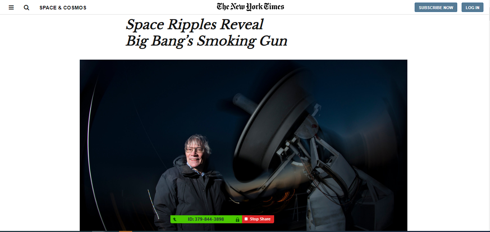

# POSITIONING AND FLOATING ELEMENTS

> Learning how to position elements in a page.

(images/screenshot1.PNG)

This project shows the format of building an HTML page and positioning/floating elements of an article. 

## Built With

- html, css

## Live Demo

[Live Demo Link](https://rawcdn.githack.com/OA7/Kikiolla-and-Osong/580f9bf7b78eebb01d49f1de2af9bf505effe51e/index.html)

## Getting Started

To get a local copy up and running follow these simple example steps.

### Prerequisites
- Web browser
- Code editor
- Git and Github

### Usage
- Clone the project to your local machine 
- Open the index file in your browser

## Authors

- Okikiola Apelehin
- Osong Agberndifor

👤 **Author1**

- Github: [@okikiola Apelehin](https://github.com/okikiola11)
- Twitter: [@okikiola Apelehin](https://twitter.com/Kikiolla3)
- Linkedin: [okikiola Apelehin](https://www.linkedin.com/in/okikiola-apelehin-459008122/)

👤 **Author2**

- Github: [@Osong Agberndifor](https://github.com/OA7)
- Twitter: [@Osong Agberndifor](https://twitter.com/Osong17)
- Linkedin: [Osong Agberndifor](https://www.linkedin.com/in/osong-agberndifor/)

## 🤝 Contributing

Contributions, issues and feature requests are welcome!

Feel free to check the [issues page](https://github.com/OA7/Kikiolla-and-Osong/issues).

## Show your support

Give a ⭐️ if you like this project!

## Acknowledgments

- Google

